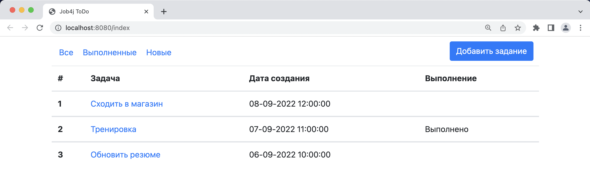
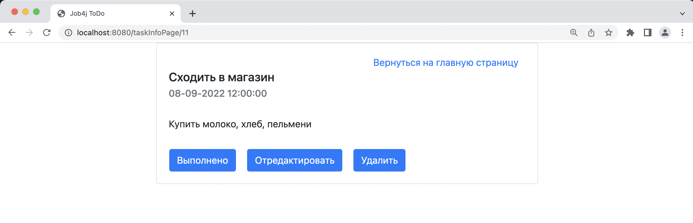
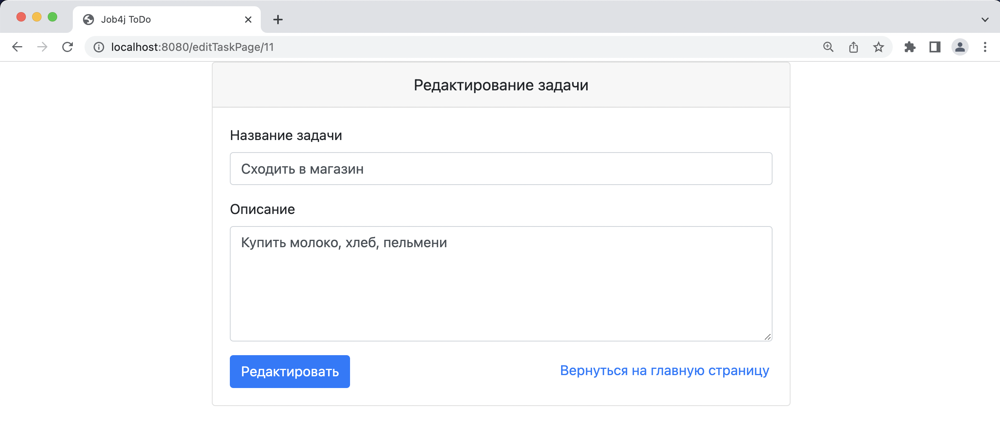
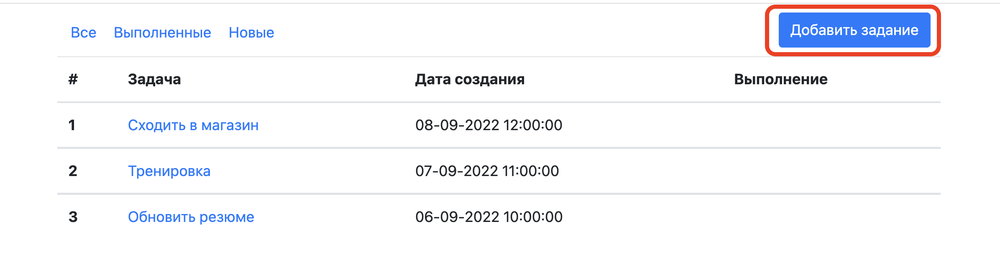
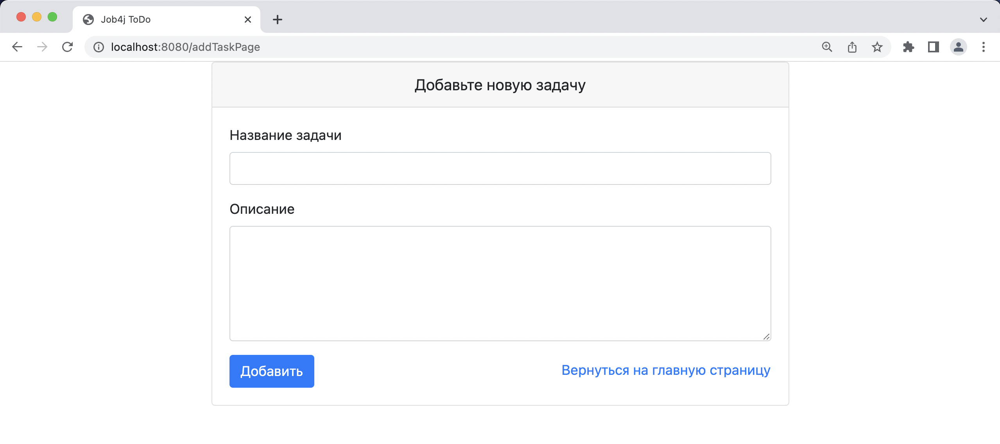

#job4j_todo

# ToDO List

## О проекте

Данный проект является учебным и представляет собой web-приложение 
по управлению списком задач.
При реализации сервиса использованы Spring boot, 
Thymeleaf, Bootstrap, Hibernate, PostgreSql. 
Управление базой данных осуществляется с помощью Liquibase.

## Запуск приложения

Для успешного запуска проекта на вашем компьютере
должно быть установлено:
- JDK 17(+)
- Maven
- PostgreSql
- Git

Процесс установки:
1. Скачайте проект к себе на компьютер, используя команду:  
`git clone https://github.com/PavelM2205/job4j_todo.git`.  
2. В PostgreSQL создайте базу данных с именем "todo_db".
3. Добавьте свои данные "username" и "password" для доступа к базе данных в файле  
`db/liquibase.properties`, а также "hibernate.connection.username" и "hibernate.connection.password"
в файле `src/main/hibernate.cfg.xml`.  
4. Перейдите в директорию проекта и выполните команду:  
`mvn install -Pproduction -Dmaven.test.skip=true`.  
5. Запустите приложение, используя команду:  
`mvn exec:java -Dexec.mainClass=ru.job4j.Main`.  
6. После запуска приложение будет доступно по адресу:
   http://localhost:8080/index .

## Использование

На главной странице отображается список задач.

Задачи можно отфильтровать, используя элементы панели в левом верхнем
углу.

При нажатии на название задачи отображается страница с подробной информацией
о задаче. Элементы управления позволяют отметить задачу, как "выполненную",
отредактровать или удалить ее.

Нажатие кнопки "Отредактировать" переводит нас на страницу для
редактирования задачи.

Для добавления новой задачи необходимо нажать кнопку 
"Добавить задание" на главной странице.

После этого попадаем на страницу для создания новой задачи.

